<div align="center">

<!-- ░░░ ASCII HERO BANNER ░░░ -->
<picture>
  <source media="(prefers-color-scheme: dark)" srcset="./dark-v3.svg">
  <source media="(prefers-color-scheme: light)" srcset="./light-v3.svg">
  
</picture>

<br/><br/>

<!-- ░░░ ANIMATED HEADER ░░░ -->


<p>
  <i>Building flawless ecosystems — from the silicon up to the service layer.</i>
</p>

<!-- ░░░ SOCIAL / CONTACT ░░░ -->
<p>
  <a href="https://anilg12.github.io/" target="_blank">
    
  </a>
  <a href="https://www.linkedin.com/in/an%C4%B1l-g%C3%BCl-753417249" target="_blank">
    
  </a>
  <a href="mailto:anillgul2002@gmail.com">
    
  </a>
  <a href="https://instagram.com/anilgl00" target="_blank">
    
  </a>
</p>

<!-- ░░░ PROFILE STATS BADGES ░░░ -->
<p>
  
  
  
</p>

</div>

---

### 🧬 whoami

```python
class Developer(Human):
    def __init__(self):
        self.name       = "Anıl Gül"
        self.born       = 2002
        self.base       = "Malatya, TR"
        self.education  = "Kapadokya University — Management Information Systems"
        self.roles      = ["Systems Engineer", "Network Specialist", "Backend Developer"]
        self.languages  = ["Java", "Python", "C#", "TypeScript", "Swift"]
        self.frameworks = ["JavaFX", ".NET / WPF", "SwiftUI", "Svelte", "Electron"]
        self.systems    = ["Windows", "macOS", "Linux", "NTLite", "Cisco"]
        self.mindset    = "Hardware, network and software are one living ecosystem."

    def current_mission(self):
        return "Emberwise — a cozy focus RPG for Windows & macOS"

    def execute(self) -> System:
        # bare-metal → HAL → kernel → backend → microservices
        return System(ready=True, full_control=True)
```

I don't just write code — I architect **end-to-end infrastructure**. From **Hardware Abstraction Layer (HAL)** integration and custom OS kernel compilation at the bare-metal level, up to modern **Java & .NET** services at the application layer, I treat IT as a single living system where every layer talks to the next. Lately that means shipping **cross-platform desktop apps** end to end — from the first line of code to the installers and CI for **Windows and macOS**.

---

### 🛠️ Tech Arsenal

**💻 Languages & Frameworks**


**🖥️ Systems & OS**


**🔩 Hardware & Platforms**


**🌐 Networking**


**🧰 Tools**


---

### 🚀 Featured Work

#### 🔥 [Emberwise](https://github.com/anilg12/Emberwise)
A cozy focus RPG for **Windows & macOS** that turns tasks into quests and every focused minute into XP — 19 hand-drawn characters, a year-long login reward path, an ambience mixer built from real field recordings and close to 400 original lines. Fully offline: no account, no ads, no tracking. A ground-up rewrite of my JavaFX [Odak Menajeri RPG](https://github.com/anilg12/Odak-Menajeri-RPG).

`Electron` · `Svelte 5` · `TypeScript` · `Vite` · `Web Audio API`

#### 🧹 [Oblivion](https://github.com/anilg12/Oblivion-Uninstaller)
Removes programs without a trace on **Windows & macOS**, native on each platform. Every registry and file-system leftover is listed with the reason it was found and a confidence level; a live system monitor, **"Hunter Mode"**, startup manager and file shredder sit under one roof. Nothing is ever pre-selected, and there's always a way back.

`C#` · `.NET 8` · `WPF` · `Swift` · `SwiftUI` · `Win32 API`

#### 📡 [SPEKTRA](https://github.com/anilg12/Spektra)
An electronic-warfare RF spectrum simulator: a frequency-hopping (FHSS) radio against two jammers over a live spectrum analyzer and waterfall, driven by a pure-Java physics core that numerically validates SJNR and PDR. Ships as a self-contained Windows MSI.

`Java 21` · `JavaFX 21` · `jlink` · `jpackage`

#### 📦 [StockFlow](https://github.com/anilg12/StockFlow)
Inventory & customer-relationship management for small businesses — my **senior-year capstone (graduation) project at Kapadokya University**, adopted into the university's own infrastructure. Built on the Python standard library alone: no `pip install`, it opens with a double-click.

`Python` · `tkinter` · `SQLite` · `Zero dependencies`

#### ⚙️ RoseOS — [Win11 LTSC Lite](https://github.com/anilg12/win11-ltsc-lite) · [Win10 NTLite](https://github.com/anilg12/Win10NTLiteLog)
Windows images slimmed down with NTLite. The Windows 11 LTSC 2024 build drops 94 components and idles at **1.8 GB RAM** while keeping security updates until 2034 — shared as a verifiable `preset.xml`, never as an ISO.

`NTLite` · `Windows 11 LTSC` · `Windows 10` · `System Tuning`

---

### 🎖️ Verified Credentials


> 14 certifications · 12 verifiable at the source — all viewable & downloadable on my [portfolio](https://anilg12.github.io/#cert-section).

---

### 📊 GitHub Analytics

<div align="center">


</div>

---

<div align="center">

### 🤝 Let's build something

I'm open to **System Administration**, **Network Engineering** and **Backend / Microservices** roles — remote or Malatya-based. If you need someone who's equally comfortable at the registry level and the service layer, you're talking to the right person.

<a href="mailto:anillgul2002@gmail.com">
  
</a>

<br/><br/>

<sub>⚡ <code>bare-metal → HAL → kernel → backend → microservices</code> · Crafted with care · MMXXVI</sub>

</div>
